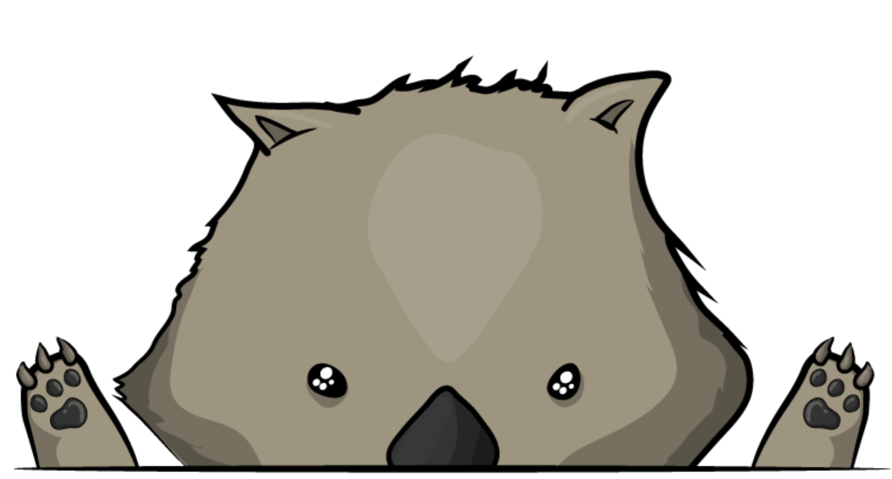
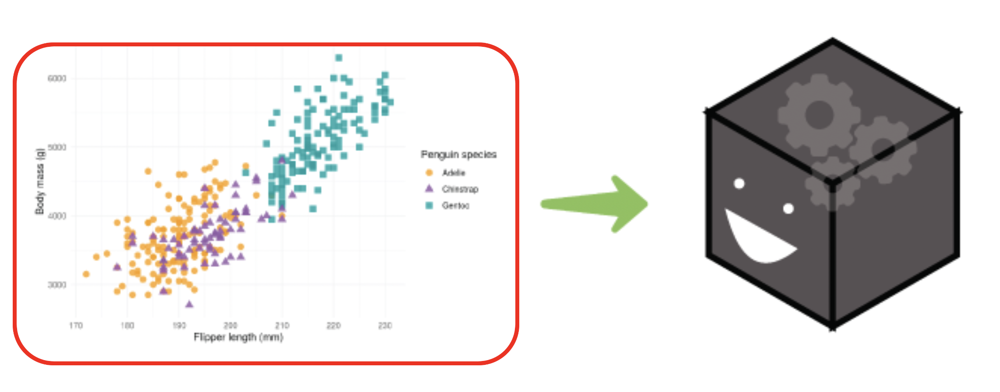
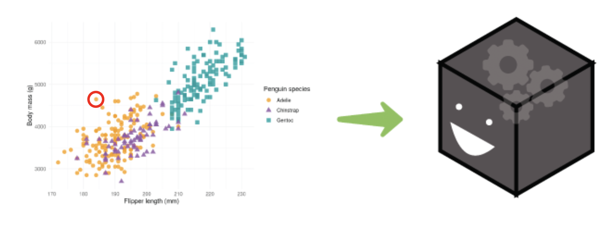
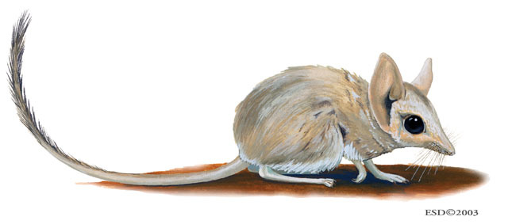

## Hi I'm Janith

```{r}
#| echo: false
#| warning: false
#| message: false

source("src/preamble.R")
source("src/data.R")
source("src/model.R")
source("src/explainers.R")
source("src/tables.R")
source("src/plots.R")
```

:::{.center-my-slide}
* I'm a PhD candidate at Monash University, Australia 
* My research work is around making it easier to explain how machine learning models work. 
* Today I'm going to be talking about,

:::{.fragment .fade-in .center}
{width=40%}
:::

:::

<!-- ## AI and Machine Learning is everywhere -->
<!---->
<!-- :::{.incremental} -->
<!-- * Like it or not, there's a surge of models created to solve problems across domains. -->
<!-- * It feels easy to create these models with easy to access compute power and less restrictions on mapping the inputs and outputs -->
<!-- * But when these models are facing the public, and we can't understand how they work, that's going to be a problem! -->
<!-- * And that is where Explainable AI (XAI) methods come in. -->
<!-- ::: -->

## Your first day at the job

::::{.columns}

:::{.column width=50%}

:::{.incremental}
* You were hired as a data science intern in the loan department of _OddPoverty_ Bank where you help wombats get loans for burrowing holes.

* As an intern, you were given a dataset to model, which will **classify** whether a wombat is eligible for a loan.
:::

:::

:::{.column width=50%}

:::{.fragment .fade-in}

:::

:::

::::

## The problem

The dataset is a simple one for an intern,has two variables, 

1. How cute the wombat is ($x$) 
2. How chonky the wombat is ($y$).

```{r}
train_data_fig
```

## Time to get modeling,

::::{.columns}
:::{.column}
You get around to making a model that works well, to double check you follow a model in data space visualisation like as follows
:::

:::{.column}
```{r}
model_preds_fig
```
:::
::::

## We have complaints! 

::::{.columns}
:::{.column width=45%}

Four wombats came up upset that their loans were rejected, and they asked **what was the important thing that we considered to deny their loan** for a burrowing hole. (Was it their cuteness or was it their chonky-ness?)

<!-- :::{.callout-note} -->
<!-- Fun fact: These are names of actual wombats in Australian Zoos, and Minibus is the name of the wombat that was Steve Irwin's favourite. -->
<!-- ::: -->




:::
:::{.column width=55%}

```{r}
poi_data_fig
```


:::
::::

## How do we explain this model to the wombats?

Explainable AI methods or XAI methods came in as a solution to this problem. 

XAI can help you look at 

:::: {.columns}

::: {.column width=50%}

<p style = "text-align:center">  </p>

How the model reacts to different features overall using <span class="accent-color"> Global Interpretability Methods </span>

:::

::: {.column width=50%}

<p style = "text-align:center">  </p>

How the model gives a prediction to one single instance using <span class="accent-color">Local Interpretability Methods </span>

::: 

::::

## Explaining one prediction

There are several key <span class = "accent-color"> local interpretability methods </span> that are related to each other in how they approach the problem

1. LIME (Local Interpretable Model agnostic Explanations)
2. SHAP (SHapley Additive exPlanations)
2. Anchors
3. Counterfactuals

## Using XAI methods 

So let's pump these in to these methods and let's help our wombats out!

```{r}
knitr::kable(disagree_table_show)
```

:::{.fragment .fade-in}
Wait so which one do we tell these wombats?
:::

## Algorithmic Disagreements

Why did this workflow fail?

* Different XAI methods probe different mathematical facets of a model.
* When you run multiple methods on the same pipeline, they **frequently yield conflicting explanations**.

We must manually reconcile abstract mathematical formulas with raw numerical outputs.

## The Isolation Problem

Despite XAI advances, current state-of-the-art tools operate in a vacuum.

* We don't see how these explanations relate to the data itself or the model's actual internal view of the data. 
* There's more to the story than just the final explanations 

We are left navigating a fragmented, disconnected ecosystem.

## Let's break it apart

XAI explanations are just the tip of the iceberg

There are more things that came together to make these XAI explanations. 

```{=html}
<link rel="stylesheet" type="text/css" href="https://cdnjs.cloudflare.com/ajax/libs/jointjs/3.7.7/joint.min.css" />
<script src="https://cdnjs.cloudflare.com/ajax/libs/jquery/3.6.4/jquery.min.js"></script>
<script src="https://cdnjs.cloudflare.com/ajax/libs/lodash.js/4.17.21/lodash.min.js"></script>
<script src="https://cdnjs.cloudflare.com/ajax/libs/backbone.js/1.4.1/backbone-min.js"></script>
<script src="https://cdnjs.cloudflare.com/ajax/libs/jointjs/3.7.7/joint.min.js"></script>

<div style="display: flex; justify-content: center; width: 100%; margin-top: 10px;">
    <div id="xai-workflow-canvas-lr" style="background: #ffffff; border-radius: 8px; box-shadow: 0 4px 6px rgba(0,0,0,0.1); width: 1040px; height: 320px;"></div>
</div>

<script>
$(document).ready(function() {
    var namespace = joint.shapes;
    
    // 1. Define Inline SVG Icons
    const svgBox = `<svg xmlns="http://www.w3.org/2000/svg" viewBox="0 0 24 24" fill="none" stroke="%230d6efd" stroke-width="2" stroke-linecap="round" stroke-linejoin="round"><path d="M21 16V8a2 2 0 0 0-1-1.73l-7-4a2 2 0 0 0-2 0l-7 4A2 2 0 0 0 3 8v8a2 2 0 0 0 1 1.73l7 4a2 2 0 0 0 2 0l7-4A2 2 0 0 0 21 16z"></path><polyline points="3.27 6.96 12 12.01 20.73 6.96"></polyline><line x1="12" y1="22.08" x2="12" y2="12"></line></svg>`;
    const svgTarget = `<svg xmlns="http://www.w3.org/2000/svg" viewBox="0 0 24 24" fill="none" stroke="%230d6efd" stroke-width="2" stroke-linecap="round" stroke-linejoin="round"><circle cx="12" cy="12" r="10"></circle><circle cx="12" cy="12" r="6"></circle><circle cx="12" cy="12" r="2"></circle></svg>`;
    const svgNetwork = `<svg xmlns="http://www.w3.org/2000/svg" viewBox="0 0 24 24" fill="none" stroke="%230d6efd" stroke-width="2" stroke-linecap="round" stroke-linejoin="round"><circle cx="18" cy="5" r="3"></circle><circle cx="6" cy="12" r="3"></circle><circle cx="18" cy="19" r="3"></circle><line x1="8.59" y1="13.51" x2="15.42" y2="17.49"></line><line x1="15.41" y1="6.51" x2="8.59" y2="10.49"></line></svg>`;
    const svgSettings = `<svg xmlns="http://www.w3.org/2000/svg" viewBox="0 0 24 24" fill="none" stroke="%230d6efd" stroke-width="2" stroke-linecap="round" stroke-linejoin="round"><circle cx="12" cy="12" r="3"></circle><path d="M19.4 15a1.65 1.65 0 0 0 .33 1.82l.06.06a2 2 0 0 1 0 2.83 2 2 0 0 1-2.83 0l-.06-.06a1.65 1.65 0 0 0-1.82-.33 1.65 1.65 0 0 0-1 1.51V21a2 2 0 0 1-2 2 2 2 0 0 1-2-2v-.09A1.65 1.65 0 0 0 9 19.4a1.65 1.65 0 0 0-1.82.33l-.06.06a2 2 0 0 1-2.83 0 2 2 0 0 1 0-2.83l.06-.06a1.65 1.65 0 0 0 .33-1.82 1.65 1.65 0 0 0-1.51-1H3a2 2 0 0 1-2-2 2 2 0 0 1 2-2h.09A1.65 1.65 0 0 0 4.6 9a1.65 1.65 0 0 0-.33-1.82l-.06-.06a2 2 0 0 1 0-2.83 2 2 0 0 1 2.83 0l.06.06a1.65 1.65 0 0 0 1.82.33H9a1.65 1.65 0 0 0 1-1.51V3a2 2 0 0 1 2-2 2 2 0 0 1 2 2v.09a1.65 1.65 0 0 0 1 1.51 1.65 1.65 0 0 0 1.82-.33l.06-.06a2 2 0 0 1 2.83 0 2 2 0 0 1 0 2.83l-.06.06a1.65 1.65 0 0 0-.33 1.82V9a1.65 1.65 0 0 0 1.51 1H21a2 2 0 0 1 2 2 2 2 0 0 1-2 2h-.09a1.65 1.65 0 0 0-1.51 1z"></path></svg>`;
    const svgSliders = `<svg xmlns="http://www.w3.org/2000/svg" viewBox="0 0 24 24" fill="none" stroke="%230d6efd" stroke-width="2" stroke-linecap="round" stroke-linejoin="round"><line x1="4" y1="21" x2="4" y2="14"></line><line x1="4" y1="10" x2="4" y2="3"></line><line x1="12" y1="21" x2="12" y2="12"></line><line x1="12" y1="8" x2="12" y2="3"></line><line x1="20" y1="21" x2="20" y2="16"></line><line x1="20" y1="12" x2="20" y2="3"></line><line x1="1" y1="14" x2="7" y2="14"></line><line x1="9" y1="8" x2="15" y2="8"></line><line x1="17" y1="16" x2="23" y2="16"></line></svg>`;
    const svgBulb = `<svg xmlns="http://www.w3.org/2000/svg" viewBox="0 0 24 24" fill="none" stroke="%23198754" stroke-width="2" stroke-linecap="round" stroke-linejoin="round"><path d="M12 2v2"></path><path d="M12 20v2"></path><path d="M4.93 4.93l1.41 1.41"></path><path d="M17.66 17.66l1.41 1.41"></path><path d="M2 12h2"></path><path d="M20 12h2"></path><path d="M6.34 17.66l-1.41 1.41"></path><path d="M19.07 4.93l-1.41 1.41"></path><path d="M9 22h6"></path><path d="M10 18h4"></path><path d="M15 12a3 3 0 0 1-6 0 5 5 0 0 1 10 0v1a2 2 0 0 1-2 2h-4a2 2 0 0 1-2-2v-1"></path></svg>`;

    // 2. Define Custom Element
    var IconNode = joint.dia.Element.define('IconNode', {
        attrs: {
            body: { refWidth: '100%', refHeight: '100%', fill: '#ffffff', stroke: '#0d6efd', strokeWidth: 2, rx: 6, ry: 6 },
            icon: { width: 24, height: 24, refX: 12, refY: '50%', refY2: -12 },
            label: { refX: 46, refY: '50%', textAnchor: 'start', textVerticalAnchor: 'middle', fill: '#212529', fontSize: 13, fontWeight: 'bold', textWrap: { width: 140, height: 50 } }
        }
    }, {
        markup: [
            { tagName: 'rect', selector: 'body' },
            { tagName: 'image', selector: 'icon' },
            { tagName: 'text', selector: 'label' }
        ]
    });

    // Helpers
    function createSubgraph(id, label, x, y, width, height) {
        return new joint.shapes.standard.Rectangle({
            id: id, position: { x: x, y: y }, size: { width: width, height: height },
            attrs: { body: { fill: '#f8f9fa', stroke: '#adb5bd', strokeWidth: 2, strokeDasharray: '5,5', rx: 10, ry: 10 }, label: { text: label, fill: '#6c757d', fontSize: 13, fontWeight: 'bold', refY: 15, textAnchor: 'middle' } }
        });
    }

    function createNode(id, label, x, y, svgStr, colorClass) {
        var strokeColor = colorClass === 'success' ? '#198754' : '#0d6efd';
        return new IconNode({
            id: id, position: { x: x, y: y }, size: { width: 190, height: 60 },
            attrs: { body: { stroke: strokeColor }, icon: { 'xlink:href': 'data:image/svg+xml;utf8,' + svgStr } }
        }).attr('label/text', label);
    }

    function createLink(sourceId, targetId) {
        return new joint.shapes.standard.Link({
            source: { id: sourceId }, target: { id: targetId },
            router: { name: 'manhattan', args: { startDirections: ['right'], endDirections: ['left', 'top', 'bottom'] } },
            connector: { name: 'rounded' },
            attrs: { line: { stroke: '#495057', strokeWidth: 2, targetMarker: { 'type': 'path', 'd': 'M 10 -5 0 0 10 5 Z' } } }
        });
    }

    // --- REVEALJS VISIBILITY FIX ---
    let isRendered = false;
    const canvasContainer = document.getElementById('xai-workflow-canvas-lr');

    const renderChart = () => {
        if (isRendered) return;
        isRendered = true;

        var graph = new joint.dia.Graph({}, { cellNamespace: namespace });
        var paper = new joint.dia.Paper({
            el: canvasContainer,
            model: graph,
            width: 1040, height: 320,
            gridSize: 10, drawGrid: false, background: { color: 'transparent' },
            cellNamespace: namespace, interactive: false
        });

        var subInput = createSubgraph('subInput', 'Input Space', 20, 20, 230, 280);
        var subStep1 = createSubgraph('subStep1', '1. Perturbation Mechanism', 270, 20, 230, 280);
        var subStep2 = createSubgraph('subStep2', '2. Optimization Objective', 520, 20, 230, 280);
        var subStep3 = createSubgraph('subStep3', '3. Final Output', 770, 20, 230, 280);

        var nodeA = createNode('A', 'Trained Black-Box Model', 40, 70, svgBox);
        var nodeB = createNode('B', 'Local Observation (x)', 40, 190, svgTarget);
        var nodeD = createNode('D', 'Compute Black-Box Mapping', 290, 70, svgSettings);
        var nodeC = createNode('C', 'Generate Local Neighbors', 290, 190, svgNetwork);
        var nodeE = createNode('E', 'Apply Optimization Criteria', 540, 130, svgSliders);
        var nodeF = createNode('F', 'XAI Explanation', 790, 130, svgBulb, 'success');

        subInput.embed(nodeA); subInput.embed(nodeB);
        subStep1.embed(nodeC); subStep1.embed(nodeD);
        subStep2.embed(nodeE); subStep3.embed(nodeF);

        graph.addCells([subInput, subStep1, subStep2, subStep3, nodeA, nodeB, nodeC, nodeD, nodeE, nodeF]);
        graph.addCells([createLink('A', 'D'), createLink('B', 'C'), createLink('C', 'D'), createLink('C', 'E'), createLink('D', 'E'), createLink('E', 'F')]);
    };

    // Use IntersectionObserver to wait until the slide enters the viewport
    const observer = new IntersectionObserver((entries) => {
        entries.forEach(entry => {
            if (entry.isIntersecting) {
                // Slight delay ensures RevealJS finishes CSS scaling before JointJS calculates link routes
                setTimeout(renderChart, 150); 
                observer.disconnect(); // Only run once
            }
        });
    }, { threshold: 0.1 });

    observer.observe(canvasContainer);
});
</script>
```

## Bringing it all together

All local, model-agnostic XAI tools can be simplified into three common blocks:

::: {.incremental}

1. **Perturbation Mechanism**
* Generates synthetic observations in the neighborhood of the target observation (e.g., masking, local sampling).


2. **Optimization Objective**
* Evaluates black-box mappings against a criterion (surrogate loss, axioms, distance metrics).


3. **Final Output**
* Returns an interpretable form (coefficients, rules, counterfactuals).
:::

## LIME

:::: {.columns}
::: {.column width=60%}

**Perturbation Mechanism**
Randomly tweaks the original input (e.g., adding noise to numbers, hiding parts of an image, or dropping words) to see how the model reacts.

**Optimization Objective**
Draws the simplest possible line (a basic model) that mimics how the complex black-box model behaves right around that specific data point.

**Final Output**
Feature weights that show exactly how much, and in what direction, each feature pushed that specific prediction.

:::

::: {.column width=40%}

```{r}
#| label: fig-2dim-lime
#| fig-width: 6
#| fig-height: 6
#| out-width: 4in
#| out-height: 4in
#| fig-align: "center"
#| fig-cap: "Geometric representation of LIME in two dimensions"
#| echo: false
lime_plot
```

:::
::::

## Kumquat

Kumquats are a smaller lime-like fruit, and was developed to help people understand the inner workings of LIME and what happens within it.

You can install kumquats from CRAN by running 

```r
install.packages("kumquat")
```

{width=50%}


## SHAP

:::: {.columns}

::: {.column width=60%}

**Perturbation Mechanism**
Tests combinations of features being "turned on" or "turned off" (using average background data to simulate a feature being missing).

**Optimization Objective**

Uses game theory math to perfectly and fairly distribute the "credit" for the final prediction among all the features involved.

**Final Output**
Shapley values, which are precise numbers for each feature that add up perfectly to explain the final prediction.

:::
::: {.column width=40%}
```{r}
#| label: fig-2dim-shap
#| fig-width: 6
#| fig-height: 6
#| out-width: 4in
#| out-height: 4in
#| fig-align: "center"
#| fig-cap: "Geometric representation of SHAP in two dimensions."
#| echo: false
shap_plot
```
:::
::::

## Counterfactuals

:::: {.columns}
::: {.column}

**Perturbation Mechanism**
Purposely searches in a specific direction to find the exact point where the model flips its decision to a desired outcome.

**Optimization Objective**
Balances two goals simultaneously: successfully changing the model's mind while making the smallest, most realistic changes possible to the original data.

**Final Output**
A "What-If" scenario (e.g., "If your income was $5,000 higher, your loan would be approved").

:::
::: {.column}
```{r}
#| label: fig-2dim-cfacts
#| echo: false
#| fig-width: 6
#| fig-height: 6
#| out-width: 4in
#| out-height: 4in
#| fig-align: "center"
#| fig-cap: "Geometric representation of Counterfactuals in two dimensions. Hollow diamond shapes represent the counterfactual observations for the observations in solid circles connected through a line."
cf_plot
```
:::
::::

## Anchors

:::: {.columns}
::: {.column}

**Perturbation Mechanism**
Randomly masks or replaces different parts of the original input to test which features are absolutely necessary for the prediction.

**Optimization Objective**
Searches for the shortest, most rock-solid condition that locks in (or "anchors") the model's decision with high confidence, no matter what else changes.

**Final Output**
Simple IF-THEN rules (e.g., "IF Age > 35 AND Married = True, THEN Approved").

:::
::: {.column}
```{r}
#| label: fig-2dim-anchors
#| echo: false
#| fig-width: 6
#| fig-height: 6
#| out-width: 4in
#| out-height: 4in
#| fig-align: "center"
#| fig-cap: "Geometric representation of Anchors in two dimensions"
anchor_plot
```
:::
::::

## Kultarr R package

```{=html}
<div style="display:flex; flex-direction: row; justify-content: space-around; align-items:center"> 
  
  
</div>
```

:::: {.columns}
::: {.column}
The existing implementations of Anchors were quite hard to work with and were quite slow as it was using an existing Java package. 
:::
::: {.column}
Kultarr is an R package that aims to provide an implementation of Anchors using a simpler algorithm and a complete set of orthogonal predicates. 

Try the package out from [https://github.com/janithwanni/kultarr](https:://github.com/janithwanni/kultarr)

:::
::::

## The proposed geometric representations,

<br/> 

```{=html}
<div style="display:flex; flex-direction: column; justify-content: center; align-items: center; width: 100%; font-size: 2.5rem; font-weight: bold; gap: 2rem">
  <div>
    <span class = "fragment fade-right" data-fragment-index=1>
      <span class = "accent-color">LIME</span> can be seen as
    </span>
    <span class = "fragment fade-left" data-fragment-index=2> 
      <span class = "accent-light-color"> regression lines</span>
    </span>
  </div>
  <div>
    <span class="fragment fade-right" data-fragment-index=4>
      <span class = "accent-color"> SHAP </span> can be seen as
    </span>
    <span class = "fragment fade-left" data-fragment-index=5> 
      <span class = "accent-light-color"> force vectors</span>
    </span>
  </div>
  <div>
    <span class="fragment fade-right" data-fragment-index=6>
      <span class = "accent-color"> Counterfactuals </span> can be seen as
    </span>
    <span class = "fragment fade-left" data-fragment-index=7> 
      <span class = "accent-light-color"> connecting lines</span>
    </span>
  </div>
  <div>
    <span class="fragment fade-right" data-fragment-index=8>
      <span class = "accent-color"> Anchors </span> can be seen as
    </span>
    <span class = "fragment fade-left" data-fragment-index=9> 
      <span class = "accent-light-color"> boxes </span>
    </span>
  </div>
</div>
```

## What did we learn?

Understanding the prediction requires us to understand all the parts that come before it

:::{.fragment .fade-in}
This extends to our everyday interactions with AI as well!
:::

When it comes to XAI explanations, 

we need to use the geometric representations along with putting the model in the data space to look at the explanation in place with the data and the model's prediction.

## But what happened to the wombats?

Explaining to the wombats what were the reasons for their rejection requires us to look at the visuals individually to understand 

:::{.incremental}
1. which part of the model is being explained?
2. is the xai method that you are using appropriate to answer the question?
:::

How exactly that should be done will be a future story! 

:::{.fragment .fade-in}
Which I should be finishing as part of my PhD
:::
